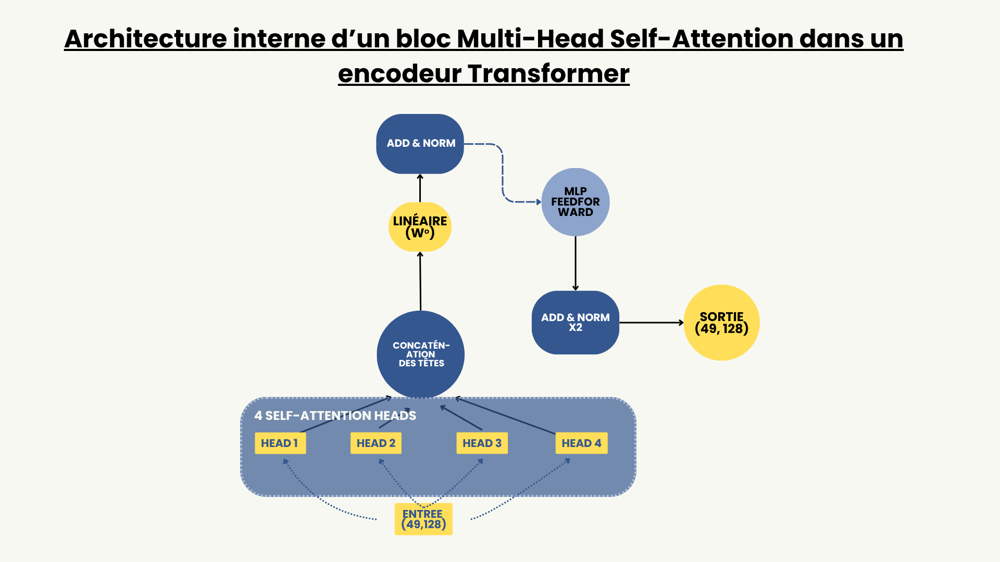
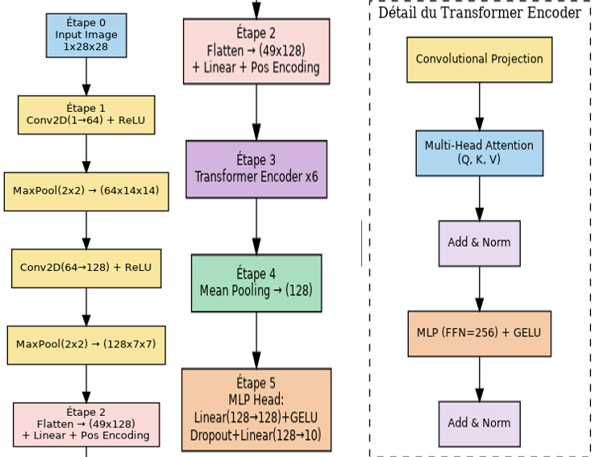

# CViT – Digit Classification from Arabic and Latin Datasets

This project implements a **Convolutional Vision Transformer (CViT)** to classify handwritten digits from **Arabic (DIDA)** and **Latin (EMNIST)** datasets.  
It combines the local feature extraction power of CNNs with the global context modeling of Transformer encoders.

---

## 📁 Project Structure

```
📂 ProjetAi_trans/
├── dida2.ipynb           # Training on DIDA dataset
├── test.ipynb            # Training/testing on EMNIST dataset
├── mnist_digits/         # 10 sample digits (0–9) used for testing predictions
├── best_model_cvit.pt    # Trained model on EMNIST (optional, local only)
├── best_model_dida.pt    # Trained model on DIDA (optional, local only)
├── assets/               # Contains architecture diagrams
│   ├── archi.png
│   └── cvit_emnist.png
└── README.md
```

---

## Model Architecture – Detailed Explanation

### 1. CNN Block

| Model | CNN Architecture |
|-------|------------------|
| `best_model_cvit.pt` (EMNIST) | Conv2d(3, 64, kernel_size=3, padding=1) → ReLU → MaxPool(2) <br> Conv2d(64, 128, kernel_size=3, padding=1) → ReLU → MaxPool(2) |
| `best_model_dida.pt` (DIDA)   | Conv2d(3, 32, kernel_size=3, padding=1) → ReLU → MaxPool(2) <br> Conv2d(32, 64, kernel_size=3, padding=1) → ReLU → MaxPool(2) |

The DIDA model uses smaller convolutional filters, making it lighter and more adapted to the smaller DIDA dataset.

---

### 2. Flatten and Linear Embedding

| Step | Description |
|------|-------------|
| Flatten | Converts CNN output to a 1D vector: shape becomes (batch_size, features) |
| Linear  | EMNIST: `Linear(128*16*16 → 512)` <br> DIDA: `Linear(64*16*16 → 512)` |

Each model maps the CNN output to a 512-dimensional space for the transformer input.

---

### 3. Transformer Encoder

| Parameter | Value |
|-----------|-------|
| d_model | 512 |
| nhead | 8 |
| num_layers | 2 |
| dim_feedforward | 2048 |
| dropout | 0.1 |

The TransformerEncoder models long-range dependencies across spatial image regions.

---

### 4. MLP Classifier

| Layers | Description |
|--------|-------------|
| Linear(512 → 128) | Feature reduction |
| ReLU + Dropout(0.25) | Activation + regularization |
| Linear(128 → 10) | Outputs raw scores for 10 digits |
| LogSoftmax | Converts scores to log-probabilities |

---

### Summary of Differences

| Component | EMNIST Model | DIDA Model |
|-----------|--------------|------------|
| CNN Channels | 64 → 128 | 32 → 64 |
| Embedding Layer | Linear(128*16*16 → 512) | Linear(64*16*16 → 512) |
| Transformer | Identical | Identical |
| Output Classes | 47 | 10 |

---

### Why this Hybrid Architecture?

- CNN layers extract local visual patterns like edges and shapes.
- The Transformer captures global interactions across the image.
- This combination allows better generalization, especially for diverse handwriting styles.

---

## 📌 Architecture Diagrams

### 1. CViT Architecture on EMNIST



---

### 2. Transformer Encoder Block (Detailed)



---

## Datasets Used

### EMNIST Digits (English Digits)
- 240,000+ grayscale handwritten digits (28×28)
- [EMNIST Digits – Download](https://www.nist.gov/itl/products-and-services/emnist-dataset)

### DIDA (Arabic Handwritten Digits)
- 250,000 RGB digit images (0–9), 64×64, various writers
- [DIDA Dataset on Kaggle](https://www.kaggle.com/datasets/mloey1/ahdd1)

> Due to size, these datasets are not included in the repo. Please download them separately and place them in `data/` or `DIDA2/`.

---

## 🧪 Testing Generalization with MNIST

To test the model’s ability to generalize, we used [MNIST PNG samples](https://github.com/myleott/mnist_png) to predict digits with both models:

| Model Trained On | Prediction on MNIST Digits |
|------------------|----------------------------|
| EMNIST           | ✅ 7/10 correct            |

See the predictions visualized in `test.py`.

---

## 🚀 How to Run

1. Clone the repo:

```bash
git clone https://github.com/Jalil03/cvit-digit-classification.git
cd cvit-digit-classification
```

2. Install dependencies:

```bash
pip install torch torchvision matplotlib
```

3. Run the test script:

```bash
python test.py
```

> It will load the model weights and predict 10 digit images from `mnist_digits/`.

---

## 📈 Training Details

- Optimizer: SGD (lr = 0.01, momentum = 0.9)
- Loss: CrossEntropy with label smoothing
- Early stopping after 3 epochs with no improvement
- Data balancing: `WeightedRandomSampler`
- Scheduler: StepLR

---

## Author

**Abdeljalil BOUZINE**  
Master AIDC – 2025  
USMS, Morocco

---

## License

This project is for academic and educational use. Datasets are licensed under their respective terms.